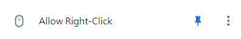
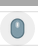
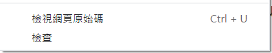
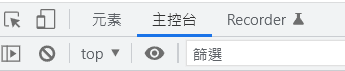
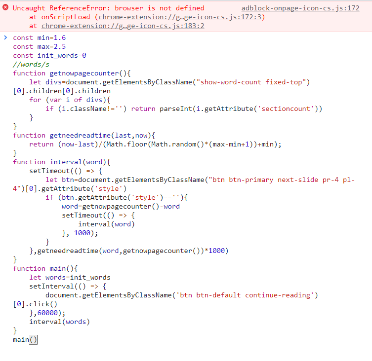

### xreading_afk
**利用腳本實現背景掛機，不用再因為其他不能背景執行的腳本而無法打apex了**

### 提醒事項

1. 此腳本使因個人興趣而製作，請勿用於營利上。
2. 如果因使用此腳本被抓，一切與我無關。
3. 各位xreading還是自己認真看吧，當作提升自己，我做這個也是因為好玩而已，我自己還是有一字一句看完的。

### 使用方式

1. 前置動作

   為了使用腳本，我們需要打開chrome的開發者介面，因xreading鎖定F12鍵所以以下提供三種開啟方法

   ### 第一種

   在閱讀介面按下 **ctrl+shift+i**

   ### 第二種

   在開始閱讀之前先按下**F12**，在進入閱讀介面

   ### 第二種

   安裝[Allow Right-Click](https://chrome.google.com/webstore/detail/allow-right-click/hnafhkjheookmokbkpnfpmemlppjdgoihttps:/)
   
   確保你有訂選 
   
   在閱讀的頁面，點擊圖示使     變成   
   
   在按下右鍵點選**檢查**按鈕  
   
2. 輸入腳本[程式碼](https://github.com/ashitamo/xreading_afk#%E7%A8%8B%E5%BC%8F%E7%A2%BC)

   按下主控台(consloe)

   

   並且將程式碼輸入進去

   

   開始掛機

### 程式碼
相關參數設定
如果閱讀有中斷，續讀時請

`const init_words=0`

將0更改為上一頁的字數

例:`const init_words=487`

```javascript
function getnowpagecounter(){
    let divs=document.getElementsByClassName("show-word-count fixed-top")[0].children[0].children
    for (var i of divs){
        if (i.className!='') return parseInt(i.getAttribute('sectioncount'))
    }
}
function getneedreadtime(last,now){
    if (last==now) return 1
    return (now-last)/(Math.floor(Math.random()*(max-min+1))+min);
}
function interval(word){
    setTimeout(() => {
        word=getnowpagecounter()-word
        let btn=document.getElementsByClassName("btn btn-primary next-slide pr-4 pl-4")[0]
        if (btn.getAttribute('style')==''){
            btn.click()
            setTimeout(() => {
                interval(word)
            }, 2000);
        }
        else document.getElementsByClassName('btn btn-primary close-book pr-4 pl-4')[0].click();
    },getneedreadtime(word,getnowpagecounter())*1000) 
    console.log('last word: ',word)
    console.log('time: ',getneedreadtime(word,getnowpagecounter())*1000)
}
function main(){
    let words=init_words
    setInterval(() => {
        document.getElementsByClassName('btn btn-default continue-reading')[0].click()
        console.log('keep continue')
    },60000);
    interval(words)
    console.log('im working')
}
main()
```

### 再次體醒

如果因使用此腳本被抓，一切與我無關
